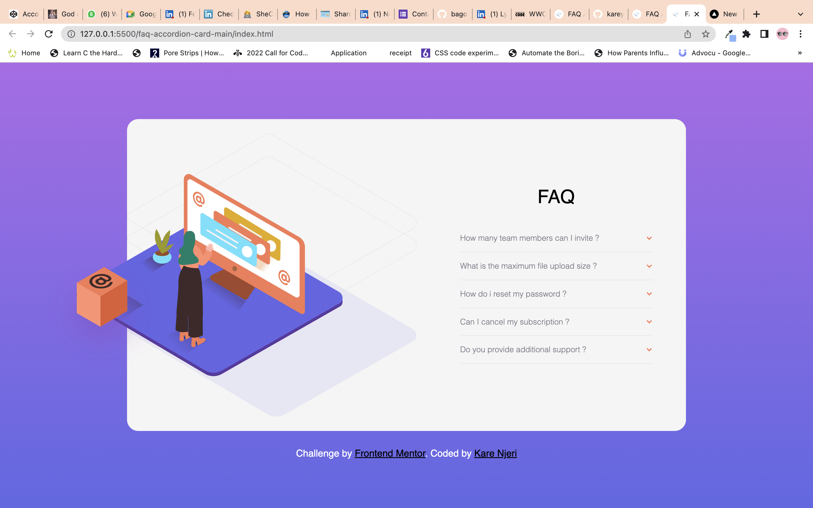

# Frontend Mentor - FAQ accordion card solution

This is a solution to the [FAQ accordion card challenge on Frontend Mentor](https://www.frontendmentor.io/challenges/faq-accordion-card-XlyjD0Oam). Frontend Mentor challenges help you improve your coding skills by building realistic projects. 

## Table of contents

- [Overview](#overview)
  - [The challenge](#the-challenge)
  - [Screenshot](#screenshot)
  - [Links](#links)
- [My process](#my-process)
  - [Built with](#built-with)
  - [What I learned](#what-i-learned)
  - [Continued development](#continued-development)
  - [Useful resources](#useful-resources)
- [Author](#author)
- [Acknowledgments](#acknowledgments)


## Overview

### The challenge

Users should be able to:

- View the optimal layout for the component depending on their device's screen size
- See hover states for all interactive elements on the page
- Hide/Show the answer to a question when the question is clicked

### Screenshot



### Links

- Live Site(https://faqs-accordion-component.netlify.app/)

## My process

### Built with

- Semantic HTML5 markup
- CSS custom properties
- Flexbox
- CSS Grid
- vanilla Javascript

## What I learned
 i have learnt about nested loops in this challenge

```
```js
for (let i = 0; i < collapseBtns.length; i++) {
  collapseBtns[i].addEventListener("click", function () {
    for (let c = 0; c < accordionCards.length; c++) {
      accordionCards[i].style.display = "block";
      collapseBtns[i].style.transform = "rotateX(180deg)";

      let showAccordion = collapseBtns[i].classList.toggle("hides");

      if (showAccordion == true) {
        accordionCards[i].style.display = "none";
        collapseBtns[i].style.transform = "rotateX(360deg)";
      }
    }
  });
}
```


### Continued development

media querries coming up

### Useful resources
(https://codepen.io/Coding_Journey/pen/RwNgYmm?editors=1010)  not useful but i found it afterward and i would refer back to this persons solution 


## Author

- Frontend Mentor - [@yourusername](https://www.frontendmentor.io/profile/wangarinjeri)
- Twitter - [@kareynjeri](https://www.twitter.com/kareynjeri1)


## Acknowledgments
my peer ifejesu for unblocking me for a very stupid error that took many hours , but i understand that is learning and i will get better with time


